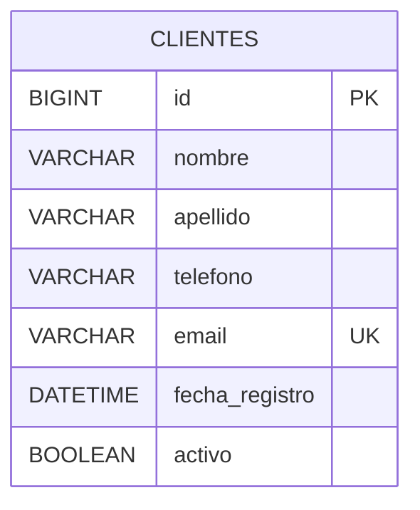

# Diagrama Entidad Relación

## Versión Inicial

---

## Descripción

La primera versión del sistema utiliza una única entidad principal denominada Cliente.

La arquitectura deberá permitir la incorporación futura de nuevas entidades sin afectar significativamente la estructura existente.

Posibles extensiones:

* Usuario
* Rol
* Producto
* Venta
* Interacción
* Proveedor
 
